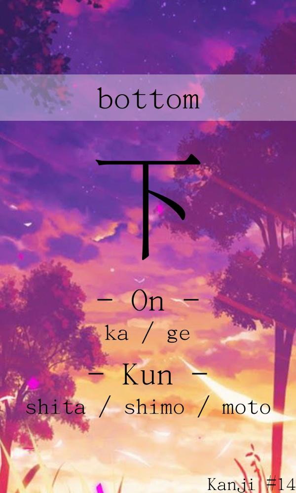

   

# Kanji Flashcard generator

Download pre-generated pdfs here: [Release](https://github.com/StoneLabs/kanji-flashcard-generator/releases)

The PDF's can be used with printers that support double side printing. 
**Warning:** *This has not been tested yet. I recommend printing only first 4 pages to test. Please report back with using the issue tracker if it worked for you!*

The script automatically creates over 1000 kanji flash cards in jpg and pdf format.

# What kanjis are this?

> Kyōiku kanji (教育漢字, literally "education kanji"), also known as Gakunenbetsu kanji haitōhyō (学年別漢字配当表, literally "list of kanji by school year") is a list of 1,026 kanji and associated readings developed and maintained by the Japanese Ministry of Education that prescribes which kanji, and which readings of kanji, Japanese students should learn from first grade to the sixth grade (elementary school).

See [Wikipedia](https://en.wikipedia.org/wiki/Ky%C5%8Diku_kanji) for more details.

# Tabletop Simulator Workshop

[Click here](https://steamcommunity.com/sharedfiles/filedetails/?id=2390856248)

# License

This is free and unencumbered software released into the public domain.

Anyone is free to copy, modify, publish, use, compile, sell, or
distribute this software, either in source code form or as a compiled
binary, for any purpose, commercial or non-commercial, and by any
means.

In jurisdictions that recognize copyright laws, the author or authors
of this software dedicate any and all copyright interest in the
software to the public domain. We make this dedication for the benefit
of the public at large and to the detriment of our heirs and
successors. We intend this dedication to be an overt act of
relinquishment in perpetuity of all present and future rights to this
software under copyright law.

THE SOFTWARE IS PROVIDED "AS IS", WITHOUT WARRANTY OF ANY KIND,
EXPRESS OR IMPLIED, INCLUDING BUT NOT LIMITED TO THE WARRANTIES OF
MERCHANTABILITY, FITNESS FOR A PARTICULAR PURPOSE AND NONINFRINGEMENT.
IN NO EVENT SHALL THE AUTHORS BE LIABLE FOR ANY CLAIM, DAMAGES OR
OTHER LIABILITY, WHETHER IN AN ACTION OF CONTRACT, TORT OR OTHERWISE,
ARISING FROM, OUT OF OR IN CONNECTION WITH THE SOFTWARE OR THE USE OR
OTHER DEALINGS IN THE SOFTWARE.

For more information, please refer to <http://unlicense.org/>
